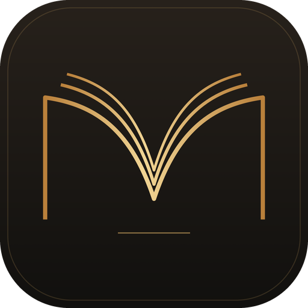
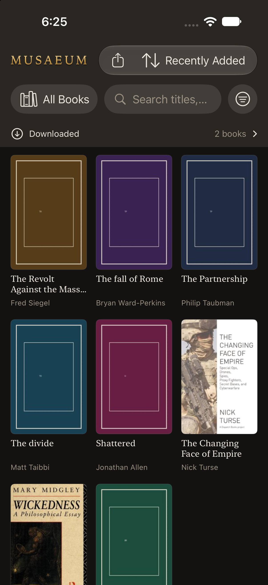
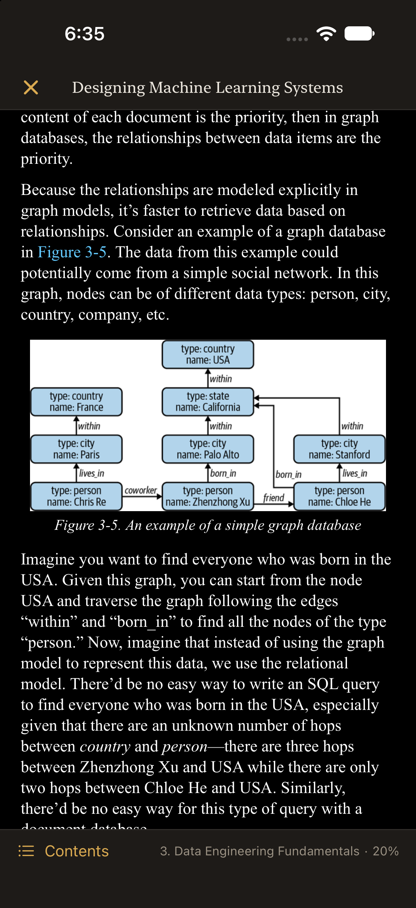

<div align="center">



# Musaeum for iOS

**The phone half of your library. Same books, same covers, same reading position — and no cloud in between.**

A reading client for [Musaeum](https://github.com/jasonoh/musaeum-macos). It browses your library over your tailnet, downloads books into its own storage, reads them where the Mac left off, and sends a book the other way, into the Mac's importer.

[](LICENSE)
[](https://github.com/jasonoh/musaeum-ios/commits/main)
[](docs/building.md)
[](docs/building.md)
[](https://github.com/readium/swift-toolkit)
[](project.yml)
[](#-unsigned-and-personal)

[Features](#-features) · [Getting started](#-getting-started) · [Where it stands](#-where-it-stands) · [Documentation](#-documentation) · [The Mac app](https://github.com/jasonoh/musaeum-macos)

<br />

&nbsp;&nbsp;&nbsp;&nbsp;

</div>

---

## ✨ Features

|                        |                                  |                                                                                                                                                                        |
| ---------------------- | -------------------------------- | ---------------------------------------------------------------------------------------------------------------------------------------------------------------------- |
| 🔌 **Connect**         | A URL and a token                | Paste what the Mac's Settings shows. The token lives in the Keychain; the check reports the contract version, the book count and whether the library share is mounted. |
| 🗂️ **Library**         | The whole thing, as a cover grid | The Mac's own eight sort orders and full-text search, so the same query returns the same books in the same order on both machines.                                     |
| 🔎 **Filters**         | Mirror the Mac's sidebar         | Read status, format, a rating floor, and the library's own authors, series and tags, with the Mac's own counts.                                                        |
| 📚 **Shelves**         | The Mac's shelves, on the phone  | Scope the list to a shelf, search and filter inside it, and add or remove a book from its page.                                                                        |
| 📖 **Reader**          | Full-bleed, out of the way       | Tap the middle for contents; tap the edges to turn pages; swipe down to close. Typography matches the desktop: serif or sans, size, spacing, Ink or Paper.             |
| ⬇️ **Downloads**       | Readable with the Mac asleep     | A book downloaded to the phone stays readable with the Mac shut or off the network entirely.                                                                           |
| 🔁 **Position**        | Travels both ways                | Opens at the fraction the Mac last recorded, and reports back when you close the book — queued while the Mac is away, ordered so a stale reading can never rewind it.  |
| ⬆️ **Send to the Mac** | From Files, Safari or Mail       | Pick a book, or share one to Musaeum. It goes through the Mac's own importer, and the row reports what happened in the Mac's own words.                                |
| 📤 **Share out**       | AirDrop, Mail, Save to Files     | Share a downloaded book under the title and author you know it by, with no extra copy on the phone.                                                                    |

## 🚀 Getting started

**You need:** a Mac running [Musaeum](https://github.com/jasonoh/musaeum-macos) with the phone server switched on, both devices on the same tailnet, and — to build this app — Xcode 27+ and XcodeGen.

**1. On the Mac:** open **Settings → Phone access** and turn it on. The row shows the URL and the bearer token.

**2. Build the app:**

```bash
brew install xcodegen
git clone https://github.com/jasonoh/musaeum-ios.git && cd musaeum-ios
xcodegen generate                  # project.yml → Musaeum.xcodeproj (regenerate after adding a file)
open Musaeum.xcodeproj             # then Run on a simulator or your own iPhone
```

**3. On the phone:** open the app, choose **Connect**, paste the URL and the token, and check the connection.

The server binds the tailnet address only, and there is no LAN or public surface. [`docs/building.md`](docs/building.md) has the command-line build and test recipe, signing, and the simulator destination.

## 🔏 Unsigned and personal

There is no App Store build, no TestFlight, and no release to download. This is an app built and run on one person's own devices, so treat every build of it as unsigned. It is built with Xcode's **free personal team**, which is enough because the app declares no entitlements. The cost is a provisioning profile that **expires after 7 days** and needs one re-run from Xcode to renew. To build for your own device, put your team in `project.yml` and re-run `xcodegen generate`.

## 🧭 Where it stands

The loop works end to end: connect, browse, download, read, report the position back, and send a book to the Mac.

- ⚠️ **No PDF in the reader yet**: PDFs are served over the wire, but the phone has no PDF engine wired up.
- ⚠️ **Downloads don't resume.** A dropped download starts again. An interrupted upload starts again too, but the Mac names a book it already has instead of making a second copy.
- ⚠️ **One book at a time**, and no local library cache: the list on screen comes from the Mac.
- ⚠️ A file that isn't a file on the phone, such as an undownloaded iCloud Drive placeholder, a Photos item or a link, is reported rather than worked around.

[`tasks.md`](tasks.md) is the roadmap, and each deferred item there is revived only by its own stated condition. [`CHANGELOG.md`](CHANGELOG.md) records what changed and why.

## 🧱 The contract is the Mac's

This repo deliberately doesn't restate the wire. The Mac app serves the HTTP surface and owns its description, and this client derives its test fixtures from that document by script, so a field the document doesn't name and the wire doesn't carry fails the suite.

- **[`docs/rest-api.md`](https://github.com/jasonoh/musaeum-macos/blob/main/docs/rest-api.md)** in the Mac repo: routes, payloads, statuses, auth, failure semantics.
- **[`scripts/api-smoke.sh`](https://github.com/jasonoh/musaeum-macos/blob/main/scripts/api-smoke.sh)** in the Mac repo: the contract's executable half, which exercises every route against a live app.

The scripts here look for the Mac repo at `../musaeum` by default. If you cloned it as `musaeum-macos`, set `MUSAEUM_REPO` or `MUSAEUM_DOC` to point at it.

## 🗺️ Layout

```
Musaeum/
  App/                    app entry and the root navigation
  Core/API/               contract models, the strict decoder, the HTTP client, the cover pipeline
  Core/Store/             settings (Keychain + UserDefaults), downloads, positions, the report queue, the upload state
  Core/Reader/            the Readium host and the pure initial-fraction rule
  Features/               Connect · Library · Detail · Downloads · Reader
Tests/MusaeumTests/       the deciders: contract fixtures, strict decoding, the queue, the two writes
Tests/Fixtures/contract/  payloads extracted from the contract document by script
scripts/                  fixture vendoring, and live-probe.sh — the app's own instrument
docs/                     specs, plans, and the frames each slice's live probe produced
```

## 📚 Documentation

| Document                                                    | What's in it                                                                                             |
| ----------------------------------------------------------- | -------------------------------------------------------------------------------------------------------- |
| [`docs/building.md`](docs/building.md)                      | Command-line build and test, signing, pointing the app at the Mac                                        |
| [`docs/what-works-today.md`](docs/what-works-today.md)      | The slice-by-slice account of what was built, frozen at slice 6b                                         |
| [`docs/specs/`](docs/specs/) · [`docs/plans/`](docs/plans/) | The client's own design (decisions CD1–CD8 and the measurements behind them) and the plan for each slice |
| [`docs/evidence/`](docs/evidence/)                          | The frames each slice's live probe produced, with the numbers beside them                                |
| [`tasks.md`](tasks.md) · [`CHANGELOG.md`](CHANGELOG.md)     | The roadmap and the history                                                                              |
| [`AGENTS.md`](AGENTS.md)                                    | The agent brief: invariants, gates and when to stop                                                      |

## 📄 License

[MIT](LICENSE) © 2026 Jason I. Oh, the same licence as the [Mac app](https://github.com/jasonoh/musaeum-macos).
